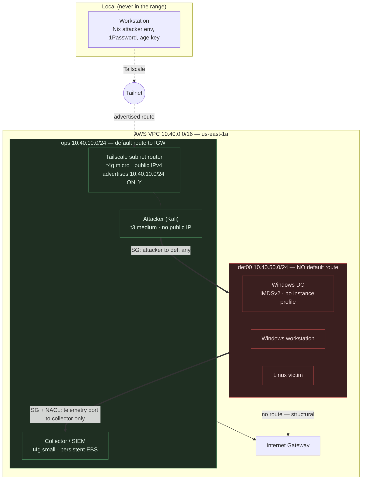
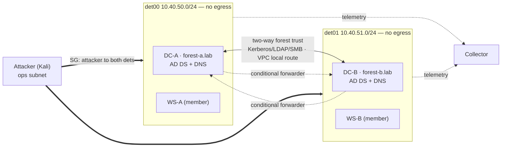

# ADR-0011: Cloud provider and range topology — AWS-only, ephemeral-by-default

- **Status:** **Accepted** 2026-09-24 — implemented in `_infra/terraform/aws/` (three
  roots: `range-network`, `ops-tier`, `scenarios/multi-forest`); Proxmox era archived
  under `_docs/archive/proxmox/`.
- **Date:** 2026-09-24
- **Deciders:** fr3d (with Claude review)
- **Related:** Implements the deferred provider/topology decision from
  [ADR-0010](0010-cloud-native-pivot.md). Carries forward the structural-air-gap
  reasoning of [ADR-0009](0009-security-lab-segmentation.md) (superseded, Proxmox era).
  Binds `.claude/rules/range-safety.md`, `.claude/rules/cost-guardrails.md`,
  `.claude/rules/terraform.md`.

## Context

ADR-0010 pivoted the range to cloud-native but explicitly deferred **which cloud** and
**what topology** — the decision that unblocks the `_infra/` rebuild. The binding
constraints are unchanged: **≤ $30/month all-in**, local Terraform state, 1Password
secrets, Windows *and* Linux first-class, Tailscale as sole entrypoint, offense *and*
defense, and reproducibility (no click-ops for scenarios).

**Windows-on-cloud was named in ADR-0010 as the pivotal constraint**, and the working
assumption was "Hetzner CX22 ≈ €4.49/mo for an always-on ops tier + a second provider
for Windows." Research for this ADR invalidated both halves of that assumption.

### Hetzner repriced twice in 2026

The CX22 plan no longer exists. Current orderable plans (Germany/Finland, September
2026; prices include the €0.50/mo primary IPv4 where applicable):

| Plan | vCPU / RAM | Old €/mo | New €/mo | Change |
| --- | --- | --- | --- | --- |
| CX23 | 2 / 4 GB (Intel, shared) | 3.99 | **5.49** | +38% |
| CAX11 | 2 / 4 GB (**Arm**, shared) | 4.49 | 5.99 | +33% |
| CPX22 | 2 / 4 GB (AMD, shared) | 7.99 | **19.49** | **+144%** |
| CCX13 | 2 / 8 GB (dedicated) | 15.99 | **42.99** | **+169%** |

The adjustment took effect 15 June 2026. Existing servers are **not** reliably
grandfathered — Hetzner's own documentation notes that "certain changes to servers with
legacy pricing may trigger a switch to the current pricing," and a rescale is one such
change. For a lab whose entire thesis is a hard cost ceiling, a provider that can move
a line item by +169% in one step is a material risk, not a footnote.

### Hetzner Windows is irreducible click-ops

Hetzner's documentation is explicit: there are **no Windows images** and no
license-included option. Installation "must be done manually" by mounting an ISO through
the web console, and VirtIO drivers (Balloon, NetKVM, vioscsi) must be hand-installed
during setup. Further, **Arm64 plans cannot run Windows at all**, which removes the CAX
line from consideration and leaves only the repriced x86 plans.

The best achievable path is *one manual console build per image → snapshot → Terraform
from snapshot*. That is a permanent click-ops step in the critical path of a
"reproducible IaC" range, plus responsibility for BYOL license-eligibility compliance.

### AWS pricing, measured rather than assumed

On-demand, `us-east-1`, taken from the EC2 price dataset rather than from recollection:

| Instance | vCPU / RAM | Linux | **Windows (license incl.)** | Spot (Windows) |
| --- | --- | --- | --- | --- |
| t4g.micro (Arm) | 2 / 1 GB | $0.0084 | *not available* | — |
| t4g.small (Arm) | 2 / 2 GB | $0.0168 | *not available* | — |
| t3.small | 2 / 2 GB | $0.0208 | $0.0392 | $0.0205 |
| t3.medium | 2 / 4 GB | $0.0416 | **$0.0600** | $0.0226 |
| t3.large | 2 / 8 GB | $0.0832 | $0.1108 | $0.0359 |

Two properties of AWS were verified because the topology depends on them:

1. **Windows activates inside a no-egress subnet.** EC2 Windows instances activate
   against Microsoft KMS on AWS at the *link-local* addresses `169.254.169.250` and
   `169.254.169.251` on TCP 1688. No Internet Gateway, NAT, or VPC endpoint is
   involved. License-included Windows therefore works unmodified inside a structurally
   air-gapped detonation subnet — which is precisely what Hetzner cannot offer without
   a manual build.
2. **AmazonProvidedDNS is a hole in invariant #1.** The VPC resolver (VPC base + 2, and
   `169.254.169.253`) remains reachable from a subnet with no Internet Gateway route,
   it **cannot be filtered by security groups or network ACLs**, and traffic to it is
   **not logged**. It recurses to the public internet on the instance's behalf. A
   detonation subnet with "no egress route" therefore still has a working, invisible
   DNS exfiltration channel. This is not covered by `range-safety.md` as written and
   must be closed structurally by this topology.

### Why the always-on tier turned out to be unnecessary

Tailscale does not require a permanently running node in the cloud: the workstation is
already a tailnet member, and a per-session subnet router joins the tailnet when it is
created. Nothing in constraints 1–6 actually requires 24/7 infrastructure. The only
genuinely persistent need is the **defensive side's index and detection content**,
which is a *storage* requirement, not a *compute* requirement — and storage is cheap.

## Decision

**Build the range on AWS alone, in `us-east-1`, single-AZ, ephemeral by default, with
zero always-on compute.** Hetzner is dropped from the design (not merely deprioritised).

### 1. Provider

AWS is the sole provider. The reasons, in order of weight:

- **Windows is license-included and image-based** — satisfies "Windows first-class" and
  "no click-ops" simultaneously, which no other cheap option does.
- **`range-safety.md` invariants 1–5 map 1:1 onto AWS primitives** — route tables
  without a default route, `associate_public_ip_address = false`, IMDSv2 with hop limit
  1, and *no instance profile* are all first-class, declarative Terraform attributes.
- **A provider-native budget exists.** `cost-guardrails.md` rule 4 makes a budget +
  alarm mandatory in every environment. AWS Budgets provides it (first two budgets are
  free). Hetzner has no cost API at all; the rule could only be met there by a cron hack.
- **Spot is available**, including for Windows, satisfying cost rule 3.
- **`/cost` already assumes `aws ce get-cost-and-usage`** — the harness was written for
  this shape.
- **One provider means one credential path, one Terraform provider, one bill.**

### 2. Cost model

Because the shared network layer contains only free resources, **standing cost is
storage only**. An Internet Gateway is free; only NAT Gateways are billed.

**Standing (always-on), per month:**

| Item | Cost |
| --- | --- |
| VPC, subnets, route tables, IGW, security groups, NACLs, DHCP option set | $0.00 |
| AWS Budgets (2 free) | $0.00 |
| Persistent SIEM index volume — 30 GB gp3 @ $0.08/GB-mo | **$2.40** |
| Cost Explorer API calls ($0.01/request, used by `/cost`) | ~$0.30 |
| **Standing total** | **≈ $2.70/mo** |

**Per-session (on-demand, `us-east-1`), a full AD-style session:**

| Component | Instance | $/hr |
| --- | --- | --- |
| Tailscale subnet router | t4g.micro | 0.0084 |
| Public IPv4 × 1 (router only) | — | 0.0050 |
| Attacker (Kali) | t3.medium | 0.0416 |
| Collector / SIEM | t4g.small | 0.0168 |
| Windows domain controller | t3.medium (Win) | 0.0600 |
| Windows workstation | t3.medium (Win) | 0.0600 |
| Ephemeral EBS (158 GB gp3, prorated) | — | 0.0173 |
| **Total** | | **0.2091/hr** |

- **Full session (8 h): ≈ $1.67.**
- **Lean Linux-only session (router + attacker + 2 × t4g.small, 8 h): ≈ $0.79.**
- **Multi-forest session (§7): ≈ $2.72/8 h** on-demand, **≈ $2.12** with members on spot.
- **Budget envelope:** $30 − $2.70 standing = **$27.30** for session hours ≈ **16 full
  single-forest sessions/month**, or **10 full multi-forest sessions/month**. The
  planning target is **12 full single-forest (or 8 multi-forest) sessions ≈ $22.80
  all-in**, leaving ~24% headroom for overruns, egress, and snapshots.

**Windows pricing, locked.** The EC2 Windows license fee is charged **per 2-vCPU pair**,
so for any 2-vCPU `t3` it is a **flat $0.0184/hr** regardless of the Linux base rate.
This makes the small `t3` sizes the sweet spot for Windows and the jump to 4 vCPU
expensive — the license alone quadruples. Confirmed against the EC2 price dataset,
`us-east-1`:

| Instance | vCPU / RAM | Linux/hr | **Windows/hr** | License Δ | Windows spot |
| --- | --- | --- | --- | --- | --- |
| t3.small | 2 / 2 GB | 0.0208 | 0.0392 | +0.0184 | 0.0205 |
| t3.medium | 2 / 4 GB | 0.0416 | **0.0600** | +0.0184 | 0.0226 |
| t3.large | 2 / 8 GB | 0.0832 | 0.1108 | +0.0276* | 0.0359 |
| t3.xlarge | 4 / 16 GB | 0.1664 | 0.2400 | +0.0736 | 0.0902 |
| m6i.large | 2 / 8 GB | 0.0960 | 0.1880 | +0.0920 | 0.1016 |

\* The `t3.large` and general-purpose families carry a higher per-vCPU Windows rate than
the `t3.small`/`t3.medium` tier. **t3.medium (2 vCPU / 4 GB) is the standard Windows host
for this range**; it is enough for a DC + DNS + a lab workload. Reserve t3.large only for
a DC also running ADCS/ESC scenarios, and accept t3.xlarge's steep license only when a
scenario genuinely needs 4 vCPU.

The Linux instance rates, the EIP rate, and the gp3 volume rate above were confirmed
against `infracost breakdown` on a model of this exact topology. Two findings from that
run are binding on the implementation:

- **Every `root_block_device` must set `volume_type = "gp3"` explicitly.** The AWS
  provider default is gp2 at $0.10/GB-mo versus gp3 at $0.08 — a silent 25% surcharge on
  all range storage.
- **`infracost` prices Windows AMIs as Linux** (it cannot infer the platform from the
  AMI ID), so it reports a Windows t3.medium at $30.37/mo instead of $43.80 — a **44%
  under-estimate per Windows host**. The cost gate mandated by `terraform.md` is only
  trustworthy for this range if Windows hosts carry an `infracost-usage.yml` override or
  a resolvable Windows AMI. Treat a bare `infracost` total on a Windows scenario as a
  floor, not an estimate.
- AWS includes 100 GB/mo of free egress, which comfortably covers artifact pulls.
- Budget alarm thresholds: **$15 / $24 / $30** (50% / 80% / 100%).

**Spot policy:** on-demand for any host holding scenario state — **domain controllers
never run on spot**, because a spot reclaim mid-scenario tears down the domain (and, in
§7, the forest trust) and forces a full re-promote. Spot is an opt-in per-scenario
variable for **stateless member hosts** only. Member workstations on spot at $0.0226 vs
$0.0600 cut a multi-forest session from $2.72 to ≈ $2.12.

### 3. Network topology

One VPC, `10.40.0.0/16`, single AZ (`us-east-1a`) to avoid cross-AZ transfer charges.
The subnet numbering deliberately preserves the ADR-0009 mnemonic — **40 = ops,
5N = detonation**.

| Subnet | CIDR | Default route | Public IP | Purpose |
| --- | --- | --- | --- | --- |
| `ops` | 10.40.10.0/24 | → Internet Gateway | router only | Tailscale subnet router, attacker, collector |
| `det00` | 10.40.50.0/24 | **none** | **none** | scenario victims |
| `det01` | 10.40.51.0/24 | **none** | **none** | scenario victims |
| `detNN` | 10.40.5N.0/24 | **none** | **none** | future scenarios |

### 4. Isolation decisions specific to AWS

These are the new, AWS-specific rulings; they supplement `range-safety.md` rather than
restate it.

**(a) The subnet router advertises the ops subnet only.** `--advertise-routes` carries
`10.40.10.0/24` and never a detonation CIDR. The tailnet — and therefore the
workstation, 1Password, and the age key — has no route to a detonation subnet. The
attack path is workstation → Tailscale → attacker box → detonation net, exactly as
`range-safety.md` §3–4 and `cloud-inventory.md` ("what stays local") require.

**(b) VPC DNS is disabled outright.** Set `enable_dns_support = false` and
`enable_dns_hostnames = false` on the VPC, plus a custom DHCP option set handing out
**public resolvers** (e.g. `1.1.1.1`). The effect is that DNS obeys the same structural
rule as everything else: it works from the ops subnet, which has a route to the
internet, and is structurally dead in a detonation subnet, which does not. This closes
the unfilterable, unlogged AmazonProvidedDNS exfiltration channel identified above.
Scenarios that need DNS *inside* a detonation segment run their own resolver in-segment
— which is more realistic anyway, since an AD domain controller *is* the domain's DNS
server.

**(c) Ops↔detonation separation is rule-based, not structural — and this is an honest
degradation from ADR-0009.** Within a single VPC, the implicit `local` route covers the
entire VPC CIDR, so a detonation host can address the ops subnet at layer 3 no matter
what the route table says. The Proxmox design's gateway-less VLAN was structural in
*both* directions; AWS's is structural only toward the internet. The mitigation is
defence in depth, and it must be treated as load-bearing rather than belt-and-braces:

1. **Security groups** — detonation SG egress is restricted to the collector's IP on the
   telemetry port; the collector's SG ingress accepts only that port from the detonation
   SG. Default egress posture is deny.
2. **Network ACLs** on the detonation subnet — stateless, subnet-level, denying the ops
   CIDR except the collector endpoint and the attacker's return traffic. Because NACLs
   are stateless, ephemeral-port return rules must be written explicitly. The baseline
   NACL **permits detonation↔detonation traffic** (other `10.40.5N.0/24` ranges): the
   same unavoidable VPC `local` route that weakens ops isolation is what lets two
   detonation subnets host a cross-subnet forest trust (§7) while both stay air-gapped
   from the internet. Inter-forest isolation, where a scenario wants it, is a
   scenario-level SG choice on top of this baseline.
3. **No instance profile and IMDSv2 with hop limit 1** on every detonation host, so a
   compromise cannot mint AWS credentials (`range-safety.md` §5).

Rejecting the structural alternative was a cost decision: separate VPCs joined by a
Transit Gateway would restore two-way structural separation but costs ~$36/mo in
attachment fees alone — it busts the entire ceiling by itself.

**(d) Only the subnet router gets a public IPv4.** One address, $0.005/hr, present only
while a session runs. The attacker and collector reach the internet through the ops
route table without public addresses of their own.

### 5. Terraform layout and state

Three roots, **local state each** per `terraform.md`, split by blast radius:

| Root | Contents | Lifecycle | Cost |
| --- | --- | --- | --- |
| `_infra/terraform/aws/range-network/` | VPC, subnets, route tables, IGW, NACLs, SGs, DHCP option set, AWS Budgets, persistent SIEM EBS volume | long-lived | ~$2.70/mo |
| `_infra/terraform/aws/ops-tier/` | subnet router, attacker, collector (attaches the persistent volume) | **per session** | hourly |
| `_infra/terraform/aws/scenarios/<name>/` | victims in one or more detonation subnets (multi-forest uses two, §7) | **per session** | hourly |

**Scenario and ops roots discover shared plumbing through tag-filtered data sources
(`aws_vpc`, `aws_subnet`, `aws_security_group`), never through
`terraform_remote_state`.** This is a security decision, not a style one: local state
holds plaintext secrets (`secrets.md`), so a disposable scenario root must never be
handed a reader for the shared root's state file. It also satisfies `range-safety.md`
§9 — a wiped or compromised scenario cannot corrupt shared infrastructure state.

### 6. Images

**Packer is deferred, and `_infra/packer/` is archived with the rest of the Proxmox
era.** Stock AMIs plus `user_data` cover every current need:

| Role | Image | Config path |
| --- | --- | --- |
| Windows DC / workstation | AWS license-included Windows Server AMI | EC2Launch `user_data` |
| Linux victim | official Ubuntu/Debian AMI | cloud-init `user_data` |
| Attacker | Kali official AWS Marketplace AMI (no software charge) | cloud-init `user_data` |
| Router / collector | official Ubuntu Arm AMI | cloud-init `user_data` |

Two consequences follow. `user_data` reaches Windows through IMDS at `169.254.169.254`,
a link-local address, so it works in a no-egress subnet. And SSM is **not** available on
detonation hosts, because reaching it would require interface VPC endpoints at ~$7.20/mo
each — out of budget. That is consistent with `terraform.md`'s ban on `remote-exec`:
configuration is image-baked or user-data, never in-band.

Accepting the Kali Marketplace subscription is a **one-time, per-account click-ops step**
that must be documented in the runbook. It is the only manual step in the design.

### 7. Multi-forest scenario (topology validation)

Cross-forest attacks — trust-key extraction and forging inter-realm TGTs, cross-forest
Kerberoasting, SID-history injection across a trust, ADCS ESC abuse over a trust,
foreign-group and `ExtraSids` privilege paths — are the most demanding AD scenario the
range must host. If the topology supports two forests joined by a trust, it supports
every lesser single-domain scenario. This section validates that it does, within budget.

**Layout.** The scenario consumes **two detonation subnets** already provisioned by
`range-network`, one per forest, and places a DC and a member in each:

| Forest | Domain | Subnet | Hosts |
| --- | --- | --- | --- |
| A (root) | `forest-a.lab` | `det00` 10.40.50.0/24 | DC-A (t3.medium Win), WS-A (t3.medium Win) |
| B (root) | `forest-b.lab` | `det01` 10.40.51.0/24 | DC-B (t3.medium Win), WS-B (t3.medium Win) |

Two separate forest **roots** (not a parent/child domain tree) joined by a **two-way
forest trust** is the configuration that exercises `ExtraSids`/SID-history and
cross-forest Kerberos; it is deliberately chosen over a single forest with two domains.

**Why the topology already supports this (no `range-network` change needed):**

- **Inter-forest L3 reachability is free and internet-isolated.** The VPC `local` route
  spans `10.40.0.0/16`, so `det00` and `det01` reach each other with no route-table
  entry, while neither has a default route off the VPC. The trust's Kerberos (88), LDAP
  (389/636), SMB (445), and RPC endpoint-mapper + dynamic range ride entirely on that
  local route. This is the §4(c) baseline-NACL allowance in use.
- **Cross-forest DNS uses conditional forwarders, not VPC DNS.** Each DC is its own
  domain's DNS server; DC-A gets a conditional forwarder for `forest-b.lab` → DC-B's
  private IP, and vice versa. This needs no AmazonProvidedDNS and therefore holds under
  §4(b)'s VPC-DNS-disabled decision — the forests resolve each other, and neither can
  resolve the internet. Confirmation that disabling VPC DNS costs the range nothing real.
- **No cloud-credential path widens.** Both DCs keep IMDSv2 + no instance profile (§4a).

**Cost.** Four Windows hosts is the range's heaviest realistic session and still fits:

| Line | On-demand | Members on spot |
| --- | --- | --- |
| router + IPv4 + attacker + collector | 0.0718/hr | 0.0718/hr |
| 2× DC-A/B t3.medium Win (on-demand) | 0.1200/hr | 0.1200/hr |
| 2× WS-A/B t3.medium Win | 0.1200/hr | 0.0452/hr (spot) |
| EBS ~258 GB gp3 | 0.0283/hr | 0.0283/hr |
| **Total** | **0.3401/hr → $2.72/8 h** | **0.2653/hr → $2.12/8 h** |

At $2.72/session the ceiling allows **~10 multi-forest sessions/month** all-in (spot
members: ~13). DCs stay on-demand per the §2 spot policy; only the two member
workstations are spot-eligible.

**The reproducibility hard part — trust bootstrap.** Forest promotion and trust creation
are multi-reboot and order-dependent, which is the one place "no click-ops for scenarios"
is under real pressure (SSM is unavailable per §6, so there is no post-boot command
channel). The plan:

1. Each DC self-promotes from `user_data` — `Install-ADDSForest` via EC2Launch v2, which
   survives the promotion reboots. This path is well-trodden and stays fully automated.
2. Trust establishment (`netdom trust` / `New-ADTrust`, two-way) can only run once *both*
   forests exist and resolve each other. It runs as a **self-deleting scheduled task on
   DC-B** that polls for DC-A's LDAP + the conditional forwarder, creates the trust, then
   removes itself — keeping the scenario a single `terraform apply` with no interactive
   step. **Fallback:** if that proves flaky, the trust is a short documented PowerShell
   snippet in the scenario runbook — a contained, per-session manual step, explicitly
   flagged as the exception rather than baked in silently.

This decides only that the **topology and budget support multi-forest**; the scenario
root itself (`_infra/terraform/aws/scenarios/multi-forest/`) and the trust-bootstrap
implementation are built during the rebuild, and the automated-vs-runbook question above
is settled there against real behaviour.

## Alternatives considered

- **Hetzner ops tier + AWS scenarios** (the ADR-0010 working assumption) — rejected.
  The Hetzner box cannot reach an AWS private subnet, so a Tailscale subnet router
  inside AWS is needed *anyway*; Hetzner then adds ~$6.40/mo standing (≈4 sessions of
  budget), a second Terraform provider, a second credential path, and a provider with no
  cost API — in exchange for capability the AWS side must provide regardless.
- **Hetzner-only with BYOL Windows** — rejected. Cheapest per hour and no license cost
  (Windows Server evaluation media is free for 180 days), and Hetzner private networks
  do provide structural isolation. But Windows requires a manual console ISO build per
  image, Arm plans cannot run Windows at all, there is no provider-native budget, and
  the June 2026 repricing (+144% CPX, +169% CCX, no reliable grandfathering)
  concentrates real budget risk in a single vendor.
- **Azure or GCP** — rejected. Windows is the same license-included model as AWS with no
  cost advantage, neither has a cheaper always-on tier that matters once the design has
  no always-on compute, and either adds a third credential path for no capability gain.
- **An always-on AWS ops tier** — rejected. t4g.micro + public IPv4 is $9.78/mo standing,
  roughly six sessions of budget, for infrastructure that is only useful while a session
  is running. Tailscale needs no permanent cloud node.
- **Two VPCs + Transit Gateway** for two-way structural ops↔detonation separation —
  rejected on cost (~$36/mo, over the ceiling on its own). Replaced by the SG + NACL +
  no-instance-profile defence in depth of §4(c).
- **VPC interface endpoints for SSM** on detonation hosts — rejected (~$7.20/mo each).
- **NAT Gateway** for controlled egress — forbidden outright by `cost-guardrails.md`
  (~$32.85/mo) and by `range-safety.md` §1.
- **Fully ephemeral defensive tier** (no persistent volume) — rejected. $2.40/mo is a
  cheap price for detection content and a cross-session baseline surviving teardown;
  without it the defensive half of constraint 6 resets every session.

## Consequences

- **Positive:**
  - **Standing cost falls to ≈ $2.70/mo**, so ~90% of the ceiling is available as
    session hours — roughly 16 full Windows+Linux sessions per month.
  - Windows is finally reproducible: a license-included AMI plus `user_data`, no manual
    image build anywhere in the pipeline.
  - Every `range-safety.md` invariant becomes a declarative Terraform attribute that
    `tflint` and review can check, rather than a procedural convention.
  - "Left it running" — ADR-0010's named top budget risk — is structurally bounded: the
    only thing that *can* be left running is per-session compute, and `/lab-status` has
    exactly one account to check.
  - One provider, one bill, one credential path; `/cost` works as already written.

- **Negative / follow-ups:**
  - **`range-safety.md` needs two new invariants** capturing §4(b) (VPC DNS disabled) and
    §4(c) (ops↔detonation is SG/NACL-enforced, not structural — treat the NACL as
    load-bearing). Until added, the rules file understates the AWS threat model.
  - **`cloud-inventory.md` is now stale**: Hetzner pricing is wrong, Hetzner should be
    recorded as evaluated-and-rejected, and `hcloud` drops off the "install when needed"
    list.
  - **The `infracost` Windows blind spot must be closed** before the cost gate is relied
    on for a Windows scenario — see the note in §2. An `infracost-usage.yml` committed
    alongside each scenario root is the likely fix, and `terraform.md`'s cost-gate rule
    should say so.
  - **The `_infra/` rebuild starts now** against the three-root layout above. The
    Proxmox `modules/` and `packer/` trees move to `_docs/archive/proxmox/` alongside
    their runbooks; this retires the pre-existing `test-range` `terraform validate`
    failure (root `outputs.tf` referencing resources inside `modules/range-network`, plus
    an unused `pve_api_token`) rather than fixing it.
  - **Single-vendor concentration** is now accepted deliberately. The mitigation is that
    the design uses only commodity primitives (VPC, subnet, route table, EC2, EBS) with
    no AWS-specific managed services, so a future port is a provider rewrite rather than
    an architecture rewrite.
  - **Windows spot is left on the table** (~36% cheaper per session) pending a judgement
    on whether interruption is tolerable per scenario.
  - **Region is `us-east-1`** for price. If latency to the attacker box proves annoying
    in practice, moving regions is a variable change, but it invalidates the exact
    dollar figures above.
